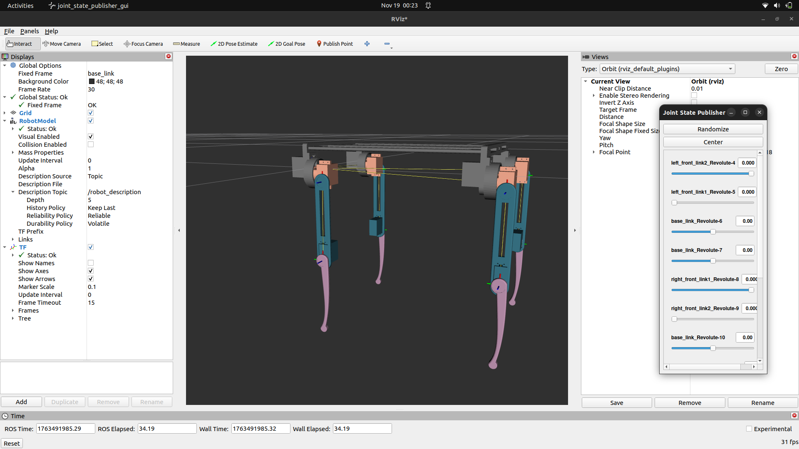

# 🤖 Twin Quadruped Robot — ROS 2 Humble  
  
  
  
  

## 🚀 Project Overview  
This repository demonstrates:

- **CAD → URDF Pipeline**  
  Creating robot parts in Fusion 360 → exporting STL → constructing a URDF with links, joints, visuals, inertials.

- **ROS 2 Control**  
  Using `joint_trajectory_controller` to send joint position commands.

- **Robot Visualization**  
  RViz2 setup for displaying the robot and visualizing joint states.

- **Custom Control Tools**  
  Python-based GUI controller + predefined trajectory publisher.

This is a compact but complete robotics showcase.

---

## 📂 Repository Structure
twin_description/  
 ├── config/              # ros2_control YAML  
 ├── launch/              # RViz2 launch files  
 ├── meshes/              # STL files (Fusion 360 models)  
 ├── rviz/                # RViz2 config  
 ├── scripts/             # GUI + command scripts  
 └── urdf/                # main URDF description  

---

## 🛠️ Requirements  
Make sure ROS 2 Humble is installed.

Main dependencies:
- ros-humble-ros2-control  
- ros-humble-ros2-controllers  
- ros-humble-robot-state-publisher  
- ros-humble-joint-state-publisher-gui  
- ros-humble-rviz2  
- python3-tk (for the GUI)

Install:
sudo apt update  
sudo apt install ros-humble-ros2-control ros-humble-ros2-controllers ros-humble-robot-state-publisher ros-humble-joint-state-publisher-gui ros-humble-rviz2 python3-tk  

---

## 🔧 Build Instructions  
source /opt/ros/humble/setup.bash  
colcon build --packages-select twin_description  
source install/setup.bash  

---

## 👀 Visualize the Robot in RViz2  
ros2 launch twin_description display.launch.py  

This launches:
- robot_state_publisher  
- joint_state_publisher_gui  
- RViz2 with the robot model  

You can move all joints via the slider GUI.

---

## 🎮 Control the Robot  
### Predefined Joint Command  
ros2 run twin_description command.py  

### Custom Joint GUI  
ros2 run twin_description joint_gui.py  

The GUI includes:
- 12 joint sliders  
- Degree → radian conversion  
- Publish button to send trajectories  

---

## 🦾 Robot Description  
- Type: Quadruped  
- Total DOF: 12 (3 revolute joints per leg)  
- Motors: MG996R-based joint limits  
- CAD: Fully modeled in Fusion 360  
- URDF: Includes visuals + limited inertial models  
- ros2_control: Configured for trajectory control  

### Joint Limits Overview (URDF vs GUI)
| Joint Name | Leg | URDF (rad) | GUI (deg) |
| --- | --- | --- | --- |
| left_front_link2_Revolute-4 | LF end | [-3.14, 0.0] | [-180, 0] |
| left_front_link1_Revolute-5 | LF mid | [0, 1.57] | [0, 90] |
| base_link_Revolute-6 | LF hip | [-1.57, 1.57] | [-90, 90] |
| base_link_Revolute-7 | RF hip | [-1.57, 1.57] | [-90, 90] |
| right_front_link1_Revolute-8 | RF mid | [-1.57, 0] | [-90, 0] |
| right_front_link2_Revolute-9 | RF end | [0, 3.14] | [0, 180] |
| base_link_Revolute-10 | RB hip | [-1.57, 1.57] | [-90, 90] |
| right_back_link1_Revolute-11 | RB mid | [-3.14, 0] | [-180, 0] |
| right_back_link2_Revolute-12 | RB end | [0, 3.14] | [0, 180] |
| base_link_Revolute-13 | LB hip | [-1.57, 1.57] | [-90, 90] |
| left_back_link1_Revolute-14 | LB mid | [0, 3.14] | [0, 180] |
| left_back_link2_Revolute-15 | LB end | [-3.14, 0] | [-180, 0] |

---

## 🎯 Purpose of This Project  
This project demonstrates my ability to:

- Design robot hardware from scratch  
- Build STL components in Fusion 360  
- Convert CAD models into a complete URDF  
- Structure a clean ROS 2 package  
- Configure ros2_control for multi-joint robots  
- Write functional Python control nodes  
- Understand quadruped kinematics & joint behavior  

It's a compact portfolio project showing practical robotics engineering skills.

---

## ⭐ Future Additions  
- Basic gait generator  
- Gazebo/Ignition simulation version  
- IMU + foot sensors (mocked or simulated)  
- Improved inertial models  

